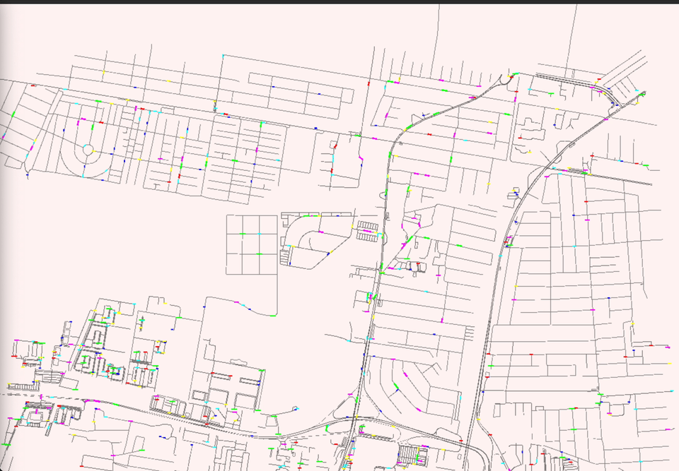
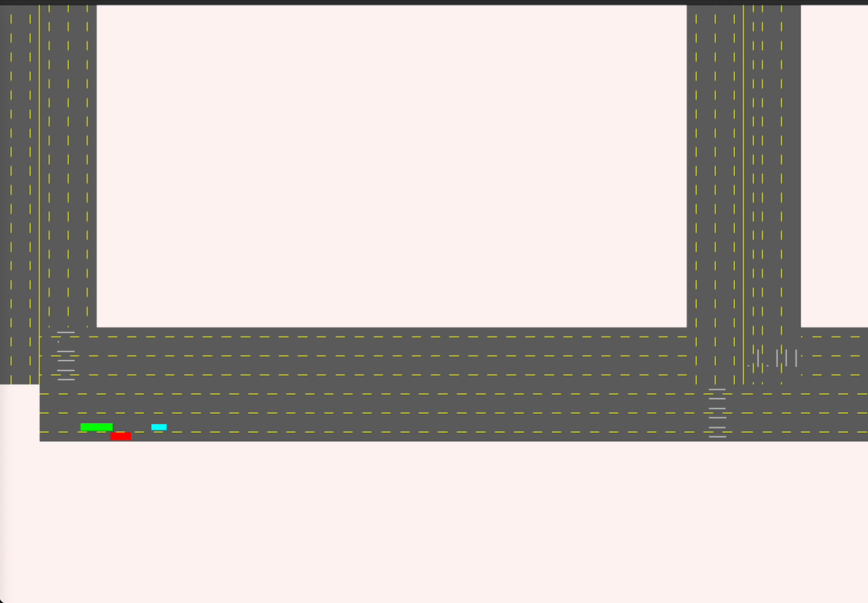
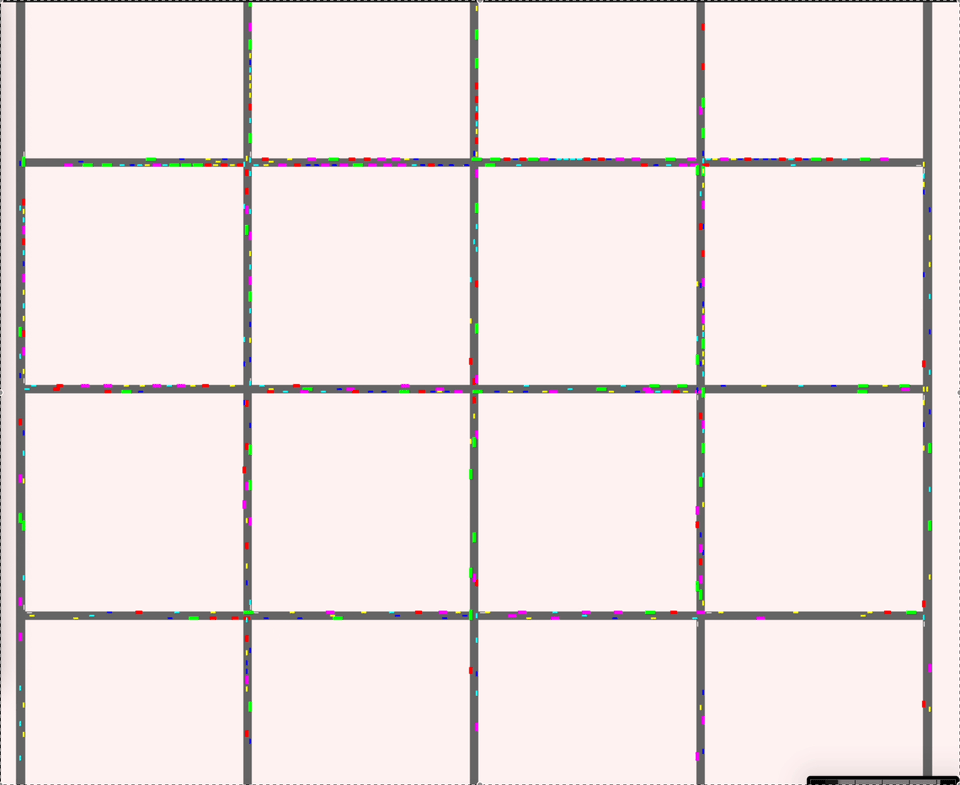

# 🚦 Traffic jam city (TJS)– Traffic Simulation Project

This project explores **traffic simulation**: parsing road data, experimenting with agent models, and visualizing how congestion emerges in a city.  
The long-term goal is to build a model that helps analyze **how road networks can be improved** for better flow.  

The architecture is prepared so that the **simulation can eventually be moved to the server**, leaving only visualization on the client.  
- **This is not planned for the near future** — there is still a lot of work required to make it happen:  
  - designing and stabilizing **data formats**,  
  - implementing a **transport layer**,  
  - managing **synchronization between clients**, etc.  
- Current focus remains on building and refining the **core simulation**.

**Technologies:** C++20, Qt6, SDL3, CMake.  
**Note:** Boost is deliberately not used — custom implementations are preferred for key utilities.

Inspired by [SUMO](https://www.eclipse.org/sumo/), PTV Vissim, and Apollo.  

---

## 📚 Documentation

- [Docs/prepare_n_build.md](Docs/prepare_n_build.md) – installation & build instructions.  
- [instructions/architecture.md](instructions/architecture.md) – project architecture overview.  

---

## 🏗 Simulation Features

### OSM Parsing
- First version: a **naive parser** that connects simple intersections.  
- From parsed OpenStreetMap data, an **internal road graph** is created:  

It is graph with `std::unordered_map<Node*, std::vector<Edge*>>` stored in [RoadNetwork](CitySimulator/src/core/include/core/data_layer/road_network.h)
Future plans: support complex junctions and multi-lane geometry.

### Path finding
- Current implementation: A* search on the road graph.
- Planned: contraction hierarchies for large networks.

### IDM + MOBIL Driving
- Lane changes follow the **Intelligent Driver Model (IDM)** with **MOBIL** lane-change logic.  
- Cooperation between vehicles is modeled when merging.  

Future plans:
- Extend the model to **intersections** and add an adjustment phase so that vehicles accelerate intelligently to slip into available slots.  
- Refactor for **cleaner FSM state changes** and add unit tests.  
- Introduce **threading** to improve performance and scalability.  

### Intersections
🚧 Not yet tracked.
There is no tracking of intersections now. It is in nearest plans.

### Traffic lights
🚧 Not yet tracked.
Should be after intersections and refactor phase.

### Agent movement model
Naive agent model: vehicles just move along lanes without collision checks. Funny, but not usable. Work in progress toward realistic movement.

# License
This project is licensed for non-commercial use and study only. Commercial use is prohibited. See [LICENSE](LICENSE) for more information.
